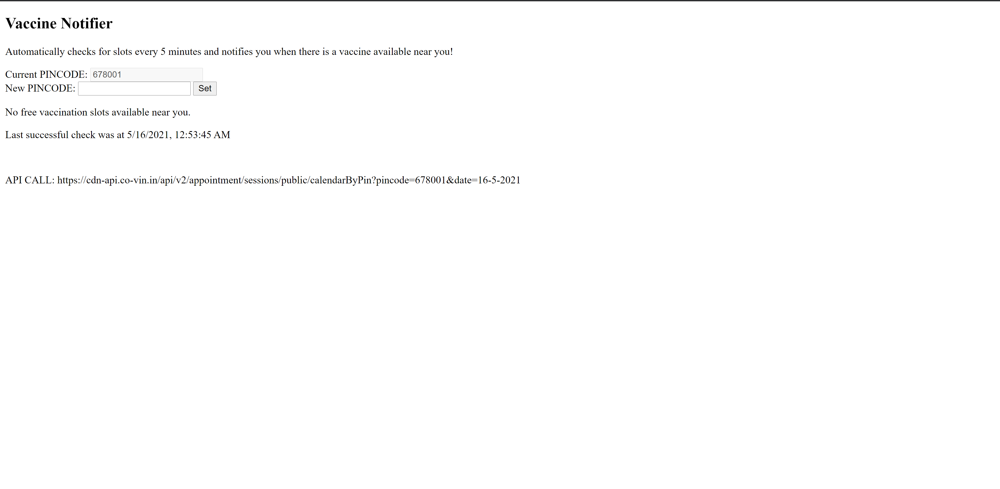
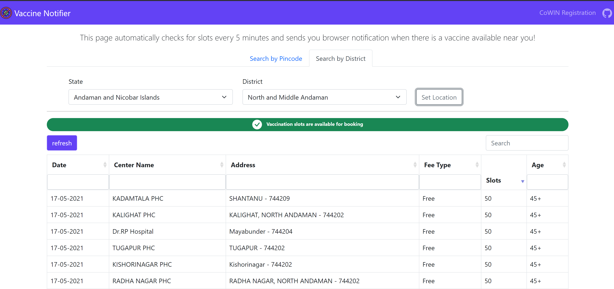

# VaccineNotifier

Simple and efficient solution to notify users about vaccine availability in their nearby centers.

## Web App

The WebApp solution is developed using HTML5, Bootstrap5 and Javascript and hosted as a static site in Azure Storage.

Live link to webpage: https://vaccinenotifier.azureedge.net

To fork and experiment locally, keep in mind that browser notifications work on the basis of Service Workers which was needed for mobile notification support. Service worker functionality requires HTTPS secure server else it will only work in the localhost system. If you need just desktop functionality, you can easily experiment by entering WebApp folder and running `python -m http.server` in terminal and accessing the address `localhost:8000`.

### Old UI for personal use vs New UI with Bootstrap

---

## Python SMS Notifier

Python script that can be run as a windows scheduled task that checks for available vaccine slots and sends you SMS using Twilio API.

Refer to README.md in PythonSMSNotifier folder for more details.
